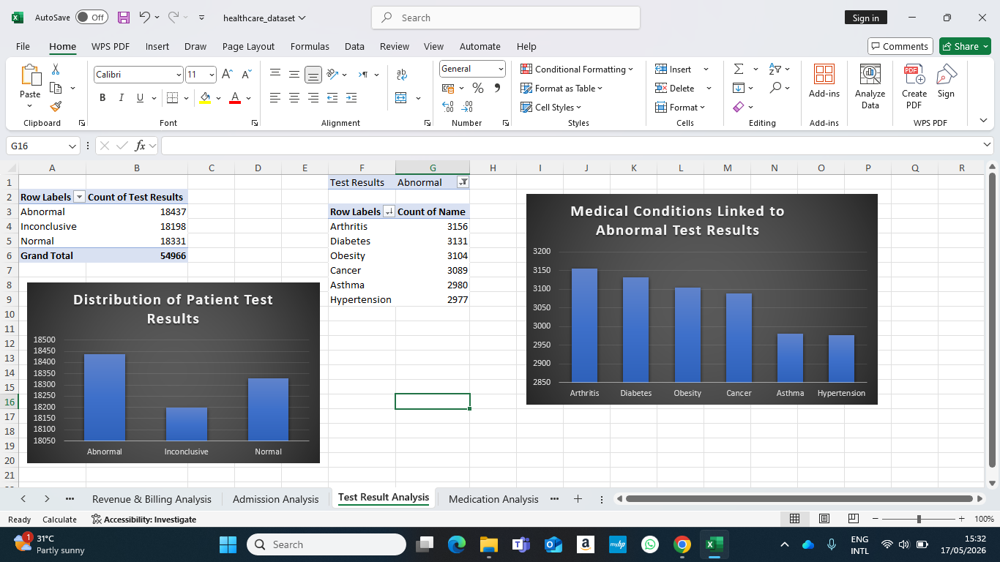
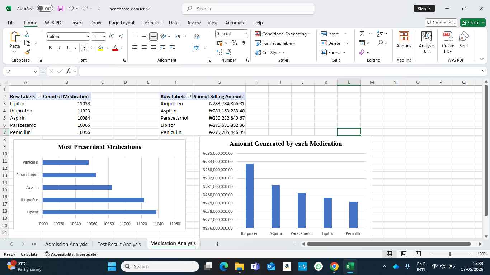

# Healthcare Data Analytics Report

# 1. Executive Summary

This project focused on analyzing healthcare records from **IOTB TECH Hospital** using Microsoft Excel Pivot Tables and Pivot Charts. The objective of the analysis was to uncover meaningful insights related to patient demographics, medical conditions, hospital revenue, admissions, insurance providers, medications, and diagnostic test results.

The analysis revealed that chronic illnesses such as **Diabetes, Arthritis, and Obesity** contributed significantly to hospital revenue and patient admissions. The study also identified patterns in monthly admissions, emergency care usage, medication prescriptions, and insurance contributions.

Additionally, the dataset contained **107 negative billing records**. These records were retained during the analysis because they likely represent billing reversals, refunds, insurance adjustments, or financial corrections commonly found in healthcare systems.

Overall, the analysis demonstrates how healthcare data can support better operational planning, financial management, patient care improvement, and strategic decision-making within hospital environments.

---

# 2. Data Cleaning & Preparation

Before the analysis was performed, the dataset was cleaned and prepared to improve accuracy and consistency.

## Cleaning Activities Performed

* Removed duplicate records
* Checked for blank rows and missing values
* Verified date formats
* Formatted billing amounts as currency
* Inspected unusual values and inconsistencies
* Created a new calculated column called **Length of Stay**

## Length of Stay Formula

```excel id="r67x6s"
=Discharge Date - Admission Date
```

This formula was used to calculate the number of days each patient spent in the hospital.

---

# 3. Negative Billing Analysis

The dataset contained **107 negative billing amounts**.

## Observation

Negative billing values are uncommon in standard sales datasets, but in healthcare systems they may represent:

* Insurance reversals
* Refund adjustments
* Billing corrections
* Payment reversals

## Decision Taken

The negative billing records were retained during the analysis to preserve the integrity of the financial dataset and avoid distorting hospital revenue calculations.

## Business Interpretation

The presence of negative billing records suggests that hospital financial operations include adjustment processes, which is realistic within healthcare billing systems.

---

# 4. Visual Evidence

> All charts and Pivot Tables were created using Microsoft Excel Pivot Charts after data cleaning and analysis.

---

# Patient Analysis

This section contains insights related to patient demographics including gender distribution, blood groups, and age group admissions.


---

# Medical Condition Analysis

This section analyzes the most common medical conditions, highest billing conditions, and conditions with the longest average hospital stay.


---

# Revenue & Billing Analysis

This section focuses on hospital revenue trends, insurance provider contributions, and revenue generated by admission types.


---

# Admission Analysis

This section examines admission trends, admission types, and emergency admissions across genders.


---

# Test Result Analysis

This section analyzes patient test outcomes and medical conditions associated with abnormal test results.



---

# Medication Analysis

This section highlights the most prescribed medications and medications associated with the highest billing amounts.


---

# 5. Key Findings & Insights

## Patient Analysis

* Total hospital patients analyzed: **54,966**
* Male and female admissions were nearly equal
* Seniors and adults recorded the highest admissions
* Children represented the lowest admission group

### Interpretation

This suggests that healthcare demand is significantly higher among adults and elderly populations due to chronic and age-related health conditions.

---

## Medical Condition Analysis

* Arthritis was the most common medical condition
* Diabetes generated the highest billing amount
* Asthma patients recorded the longest average hospital stay

### Interpretation

Chronic illnesses are major contributors to both hospital revenue and long-term healthcare utilization.

---

## Revenue & Billing Analysis

* Total hospital revenue exceeded **₦1.4 Billion**
* Revenue peaked during July and August
* Cigna was the highest contributing insurance provider
* Elective admissions generated the highest revenue

### Interpretation

Hospital revenue is strongly influenced by chronic disease management and insurance-supported patient care.

---

## Admission Analysis

* Elective admissions were the most common admission type
* Female patients recorded slightly higher emergency admissions
* Mid-year months recorded the highest patient inflow

### Interpretation

The hospital experiences seasonal increases in patient demand, requiring strategic operational planning during peak periods.

---

## Test Result Analysis

* Abnormal test results were the most common diagnostic outcome
* Arthritis patients recorded the highest abnormal test results

### Interpretation

This indicates increased diagnostic monitoring and healthcare attention among chronic illness patients.

---

## Medication Analysis

* Lipitor was the most prescribed medication
* Ibuprofen generated the highest medication billing amount

### Interpretation

Pain management and cardiovascular-related medications contribute significantly to pharmaceutical demand and revenue generation.

---

# 6. Business Recommendations

## Improve Chronic Disease Management

The hospital should expand healthcare programs focused on chronic illnesses such as Diabetes, Arthritis, and Obesity.

---

## Increase Resource Allocation During Peak Months

Additional staffing and medical resources should be provided during high-admission months such as July and August.

---

## Strengthen Insurance Partnerships

The hospital should strengthen relationships with major insurance providers like Cigna to improve long-term financial stability.

---

## Enhance Diagnostic Services

Given the high number of abnormal test results, the hospital should improve diagnostic efficiency and preventive healthcare programs.

---

## Improve Medication Inventory Planning

Frequently prescribed medications such as Lipitor and Ibuprofen should be prioritized in inventory management to avoid shortages.

---

# 7. Conclusion

This healthcare data analysis project demonstrates how Microsoft Excel can be used to transform raw healthcare records into actionable business insights using Pivot Tables and Pivot Charts.

The analysis revealed important trends in:

* Patient demographics
* Medical conditions
* Revenue generation
* Hospital admissions
* Insurance contributions
* Medication usage
* Diagnostic outcomes

Overall, the findings can support hospital management in improving operational efficiency, financial planning, patient care delivery, and strategic decision-making.
